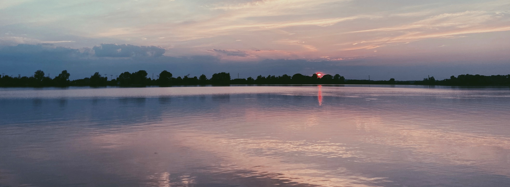
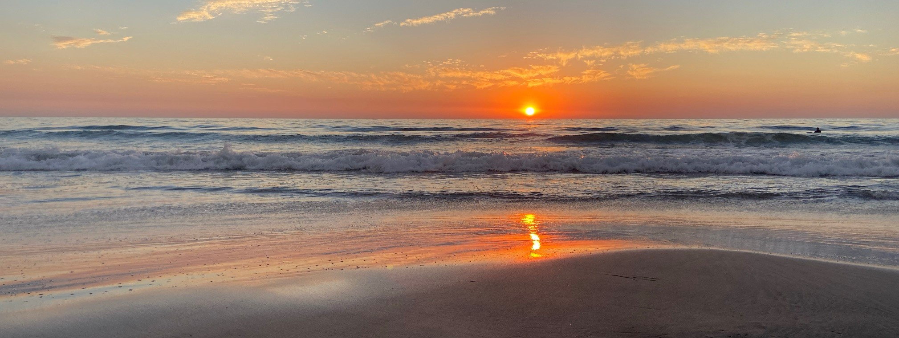
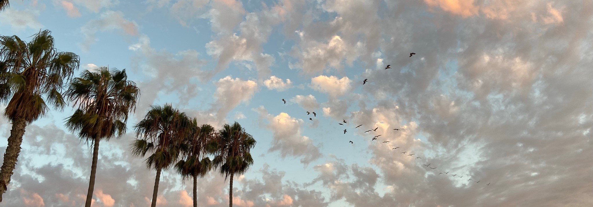

<!-- Google tag (gtag.js) -->

### Preface
Be it horse, car, human, or even lizard, our lives are but the brightest flashes in a universe that is billions of years old. In the great grand scheme of things, we are just tiny specks that will one day be forgotten. So, it doesn’t matter what we did in the past, or how we will be remembered. The only thing that matters is that now, this moment, this spectacular moment we are sharing together. 

Welcome to my world.

### Past

My name is Victoria Zhanqi Zhang, 张展旗. My name comes from a line from [Mao's poem](https://baike.baidu.com/item/%E5%A6%82%E6%A2%A6%E4%BB%A4%C2%B7%E5%85%83%E6%97%A6/5962399) in 1930 that paints a vivid picture of a scene of a red flag fluttering in the wind with mountains, representing victory, joy and confidence.

I grew up in a small town in China. When I was 12, my family moved to Beijing. Being young, I had no concept of Huji, the national registration system that restricts eligibilities for state-monitored services to limit population mobility. My Huji destined me ineligible for any education in the capital city. A month before the fall semester, a school made an exception to take me in. Despite this, I worked hard to free myself from the shackling system. My aspiration for my new future almost shattered in the summer before college. Overnight, my family had no money; my father went to jail. My precious admission letter to Wash U quickly depreciated as relatives suggested me giving up my American dream. Nonetheless, my mom, who had given up college to care for her aging father, would not let this dream die. She sold her jewelries for 200 dollars and sent me to the airport. That 200 dollars was all I had when I first stepped into the United States in 2016.

Fresh off the boat, I struggled to find my voice in the engineering classroom and to confidently articulate my thoughts in front of male classmates. I learned to seek guidance and, when I was at my lowest point, my advisors, [Dr. Emily Boyd](https://engineering.wustl.edu/faculty/Emily-Boyd.html) in Mechanical Engineering, and [Dr. Caitlin Kelleher](https://engineering.wustl.edu/faculty/Caitlin-Kelleher.html) in Computer Science, both exemplars of successful women in STEM, provided solace. They taught me that it is okay to feel lost, but I needed to move forward step by step.

My early years taught me to never give up and motivated me to discover, conquer and achieve. I fell in love with Computer Science, Electrical Engineering, and Neuroscience at [Washington University in St. Louis](https://wustl.edu/). Actively participating in seminar series and journal clubs, I am fascinated by how machine and biological intelligence complement each other to push forward the discoveries in science.

All these experiences led me here but *what is my plan to do with the one wild and precious life?* I wasn't sure at first. Through a serendipitous series of small dots aligning, I joined [Dr. Carlos Ponce](https://ponce.hms.harvard.edu/)’s laboratory at WashU to study visual information encoding in the primate brain. This valuable experience has instilled in me a passion for the deeper insights of scientific research and motivated me to pursue a doctoral program.

Starting from nothing, I cultivated my resilience and it was tied to the support people had given me along the way: that first school that opened its doors, my mother who sold her jewelry, my STEM professors, and my graduate school advisors. I have learned how to work hard even beyond my research in the lab. Throughout college, I tutored to make ends meet. It was also my chance to give back to many underrepresented people. Some were female students experiencing subtle stress in male-dominated courses and some came from minority ethnic groups with immense family pressure. As a girl excluded by the Huji system and raised in a family that longed for a boy, I related to their stories. My tutoring sessions became a place for my students to get homework help but also to be heard and empowered. 

### Present

I am currently a Ph.D. student in Computer Science at [UCSD](https://ucsd.edu/), supported by HDSI Phd Fellowship. I am honored to be co-advised by [Dr. Mikio Aoi](https://aoilab.biosci.ucsd.edu/) and [Dr. Gal Mishne](http://mishne.ucsd.edu/). As someone who has personally experienced the challenges of depression and understands the immense impact it can have on one's life, I am deeply motivated to develop human-centered AI technologies to address and alleviate clinical mental health disorders. My personal journey with depression has given me a unique perspective and a profound empathy for the patients who struggle with similar issues. I believe that by integrating my firsthand understanding of the emotional and psychological aspects of these conditions with cutting-edge human-centered AI technology, I can create solutions that are not only clinically effective but also deeply compassionate and patient-focused. My goal is to bridge the gap between the scientific and human aspects of mental health care, ensuring that individuals facing these disorders receive the support and solutions they truly need and deserve. Currently, I am attempting to construct behavior models to understand bipolar disorders in psychiatry using tools in computer science, neuroscience, and signal processing. I’m listing all my projects [here](https://zhanqizhang66.github.io/publications/) and documenting my prose, poem and essays as well as mylearning notes in this [blog](https://zhanqizhang66.github.io/blog/).   

In graduate school, I hope to keep promoting diversity in the community through teaching and service. I am a mentor at [Simons Foundation Global Brain Program](https://www.simonsfoundation.org/collaborations/global-brain/people/?category=global-brain-surf-mentors&type=global-brain-fellows). I connected undergraduate mentee from underrepresented backgrounds to research opportunities, provide strategies for handling difficult work situations, and offer positive feedbacks. I am also a member of [UCSE CSE DEI community](https://cse.ucsd.edu/diversity/cse-dei-committee). At home, when Chinese gender norms stripped girls of opportunities, I encouraged my younger sister to run for leadership roles and to join the formerly male-only
football team. On social media, I lead women in China today on issues like #MeToo.

*The dark nights gave me my dark eyes yet I use them to look for light.* As an INFJ (the rarest personality type across the population, only 2%), I am compassionate, idealistic, and always attached to a mission, a calling, and a purpose. My free time is usually filled with art, music, literature, and an appreciation of nature. I enjoy painting, reading, hiking, traveling, and surfing. Beginner golfer. I live with happy free-flying birds: cockatiel Ashe, Pearl, and parakeet Kiwi. I love DIY swings and castles for them and teaching them new songs and cool tricks. Here is the [art portfolio](https://zhanqizhang66.github.io/art/) if you want to take a peek at (and appreciate) my drawings. I am also committed to conservation and waste reduction and I volunteer to remove trash and plastics on San Diego beaches. 

### Future

I had been truly lost, but through a supportive community and determination, I connected my
dots and found my way. I can see myself as a
competent and enthusiastic scientist, and an empathetic and resilient human being. I will
continue to engage in research and contribute to society and I hope my research and support
will one day become a dot in someone else’s path.
